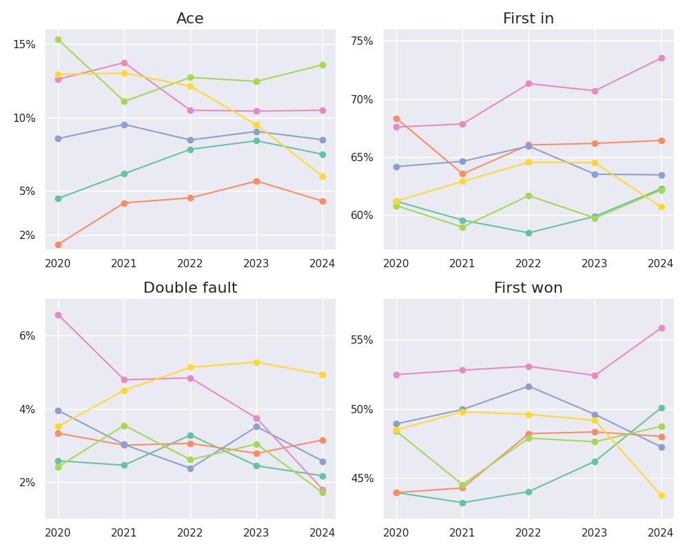

# Analysis of ATP data  
### Project under work!  
  
This project is divided into two parts. In [part one](#Part-One) I wanted to analyze some stats of the players in order to answer some questions. In [part two](#Part-One) I built a Machine Learning model to study Djokovic's stats and tried to predict the outcome of matches.  

## Part One  
We want to answer the following questions:
1. Which player has the most efficient serve?
2. How do players compare in different surfaces? Has the match distribution over different surfaces much influence on the ranking?
3. How did the performances of the players evolve in the last years? Who had the biggest improve and who had the strongest decline?
  
**Question 1**

**Question 2**  
Under work  
**Question 3**  
Under work    

## Part Two
These are the results I obtained 
| Algorithm | Train score | Test score |  
| :-: | :-: | :-: |
| SVM | 0.93 | 0.93 |    
| Logistic Reg. | 0.91 | 0.92 |  
| Binary Tree | 0.92 | 0.96 |