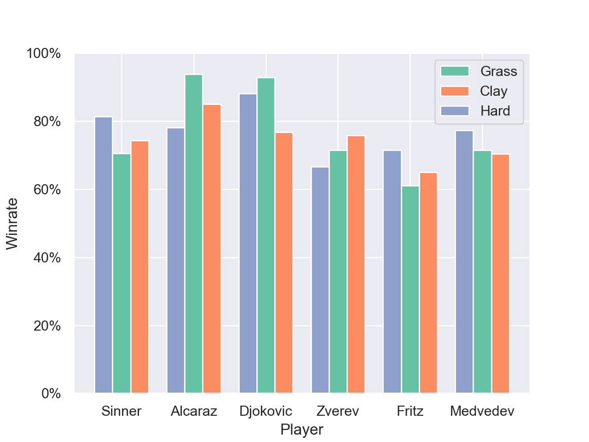

# 🎾 ATP Data Analysis & Match Outcome Prediction

This repository presents an end-to-end data science project based on ATP tennis data.  
The dataset was taken from [Jack Sackmann's Tennis ATP Database on GitHub](https://github.com/JeffSackmann/tennis_atp), where one can also find feature descriptions and additional informations.

The project is divided into two main parts:
- [Part One](#part-one-exploratory-data-analysis): exploratory data analysis (EDA) on top-six players' statistics.
- [Part two](#part-two-djokovic_exploratory-data-analysis): exploratory data analysis (EDA) on Novak Djokovic's statistics.
- [Part Three](#part-two-machine-learning-model): building a machine learning model to study Novak Djokovic's performance and predict match outcomes.

---

## Part One – Exploratory Data Analysis

The goal of this section is to answer a few data-driven questions using ATP match statistics.

### ❓ Key Questions:
1. Which player has the most efficient serve?
2. How do players perform across different court surfaces? Does surface specialization affect rankings?
3. How have players’ performances evolved in recent years? Who has shown the greatest improvement or decline?

---

### 📊 Question 1 – Serve Efficiency
We explore serve statistics across a selected group of players.

Alexander Zverev stands out as the best server. This is meant in terms of consistency (few double faults) but also efficacy (highest first-in and first-won rates). The number of aces does not stand out, indicating that Zverev prefers a slightly less aggressive but more consistent serve.  
  
An evident improvement is the one showed by Jannik Sinner. The first-won rate increased by more than 5% in the last 4 years, and the ace rate has also evidently increased. In fact Sinner admitted that he worked particularly hard on his serve in tha last year, which was considered one of his weakest point, at least compared to the other top players. Now he can be considered one of the top servers in the circuit.  
  
In contrast, Daniil Medvedev was subjected to a strong and constant decline in the last years: the number of aces has dropped and the double faults rate has increased.

---

### 📊 Question 2 – Surface Comparison & Match Distribution  
**Status: In progress**  
Exploration of win rates on different surfaces (hard, clay, grass) and their impact on overall performance and rankings. We consider only matches in 2022, 2023, and 2024.  

Sinner's favorite surface is clearly the hard one. His playing style, characterized by long and powerful shots, fits tremendously well on such surfaces. Note also that 3 out of 3 of his Grand Slam victories were taken on hard courts: one US Open (2024) and two Australian Open (2024, 2025).  
Alcaraz, on the other side, is the king of grass courts. He won the last two editions of the Wimbledon Tournament (2023, 2024). Moreover, he also won one edition of the US open (2022), and one Roland Garros (2024).

---

### 📊 Question 3 – Performance Trends Over Time  
**Status: In progress**  
We aim to analyze year-over-year player evolution in performance metrics. We take under consideration the win rate.

  

The first thing that one can note, is the impressive and constant improvement that Sinner showed over the last years. He has now, by far, the highest number of wins. And this is not because he plays only important matches: as one can see, he is also one of the players with the highest number of matches played.  
Djokovic's age probably stroke in, causing his fitness to be less costant: this is why we can observe such decline.  
Alcaraz seems to be pretty stable over the years.

---

## Part Two – Djokovic Exploratory Data Analysis

This section focuses on Novak Djokovic.  

  
  

---

---

## Part Three – Machine Learning Model

This section focuses on training a binary classifier to predict match outcomes based on Novak Djokovic's historical stats.

### ⚙️ Model Summary

| Algorithm       | Train Accuracy | Test Accuracy |
|----------------|----------------|---------------|
| SVM             | 92%           | 95%          |
| Logistic Regression | 86%      | 91%          |
| Decision Tree   | 80%           | 86%          |
| Random Forest | 98% | 98% |

> 📌 Note: More models and cross-validation results may be added in future updates.

---

---

## 🛠️ Tools & Technologies

- Python, Pandas, Plotly
- Scikit-learn
- Jupyter Notebooks
- Git & GitHub

---

## 🚧 Work in Progress

Future updates will include:
- Full EDA for surface-based insights
- Feature importance analysis
- A simple API or dashboard to interact with the model

---